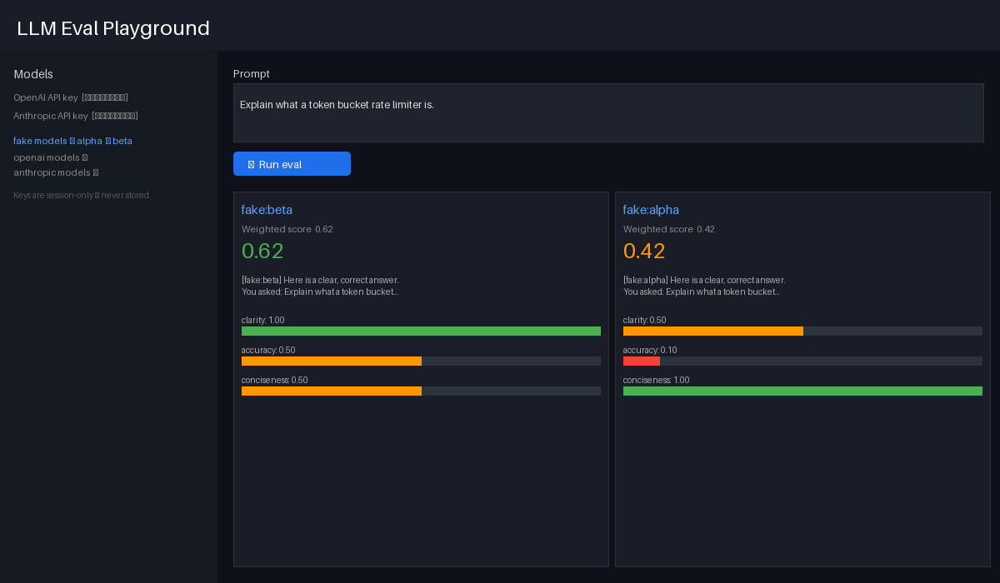

# llm-eval-playground

[](https://github.com/jakob-prince/llm-eval-playground/actions/workflows/ci.yml)
[](https://llm-eval-playground-hbhkccgv2ynxoj9xz2ht2v.streamlit.app/)

**▶ Try it live:** https://llm-eval-playground-hbhkccgv2ynxoj9xz2ht2v.streamlit.app/ — boots on fake models with no key; paste your own OpenAI or Anthropic key in the sidebar to use real providers (session-only, nothing charged by default).

> Run one prompt across multiple LLMs side-by-side and score every output against a weighted rubric — a small, visual, interactive eval harness.



`llm-eval-playground` is a tiny but real LLM-evaluation app: type a prompt, pick which models/configs to run, and see each model's output **next to** a per-criterion rubric score and a weighted total. It's an *eval harness you can actually look at* — the kind of AI-tooling artifact that's easy to demo live and easy for a reviewer to grok in 30 seconds.

## Why this exists

Comparing LLM outputs by eyeballing a chat window doesn't scale and isn't repeatable. A good eval needs: the **same** prompt fanned out to multiple models, a **rubric** so scoring is consistent, and a **visible grid** so differences pop. This repo is a minimal, well-factored take on exactly that.

## Architecture

The grading logic is a framework-agnostic **pure-Python core** — the UI is just a thin shell on top, so the interesting part is fully testable without a browser or an API key.

```
┌────────────────────────────┐
│        Streamlit UI        │   prompt box · model picker · results grid
└─────────────┬──────────────┘
              │ calls
┌─────────────▼──────────────┐
│            core            │
│  adapters/  model adapters │   ModelAdapter protocol → OpenAI / Anthropic / fake
│  rubric.py  rubric scorer  │   Judge protocol (LLM-as-judge) + weighted_total()
│  eval.py    orchestration  │   fan prompt → models, grade each, assemble grid
└────────────────────────────┘
```

Two seams make it clean and demoable:

- **`ModelAdapter` protocol** — every model (OpenAI, Anthropic, …) is one adapter; a `FakeAdapter` returns canned text so the app and tests run with **no key and no spend**.
- **`Judge` protocol** — scoring is "LLM-as-judge" in production but a deterministic fake in tests, so CI grades without calling anything.

## Quick start

```bash
uv sync --extra dev
uv run streamlit run app.py        # opens the playground in your browser
```

No API key? It boots with the **fake** model + judge so you can click through the whole flow offline. To use real models, paste your own key in the sidebar (see below).

## 🔑 Keys & cost (read this)

**Bring-your-own-key by design.** The app never ships with a baked-in key. You paste *your own* key into the sidebar at runtime; it lives only in your session and is used only for your runs. The public hosted demo therefore has **no owner key to drain** — a visitor either runs the free fake models or supplies (and pays for) their own.

> Do **not** wire a personal key into a publicly hosted instance as a "no-setup convenience." That's the one configuration that turns someone else's clicks into your bill. BYOK avoids it entirely.

## Tests

```bash
uv run pytest          # rubric + eval logic, all on fakes — no network, no keys
```

## License

MIT
